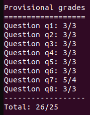
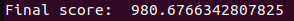

# CS188: Introduction to Artificial Intelligence

This project is a course taught at University of California, Berkeley, which is also available to the public through this link: <a href="https://inst.eecs.berkeley.edu/~cs188/fa18/">PACMAN-AI<a>. 
    
Here are the project lists:
<body style="margin: 0; padding: 0;">
<table style="width:100%">
    <tr>
        <th> Project </th>
        <th> Concepts </th>
        <th> Score </th>
        <th> Link </th>
    </tr>
    <tr>
        <td> P1: Search </td>
        <td> 
            <ul>
                <li>DFS</li>
                <li>BFS</li>
                <li>UCS</li>
                <li>A* Search</li>
                <li>Heuristics</li>
            </ul>
        </td>
        <td>  </td>
        <td><a href="https://github.com/dkhor2003/UCB_CS188/tree/main/Pac-Man_Search/search">SEARCH</a></td>
    </tr>
    <tr>
        <td> Mini-Contest 1: Multi-Agent Pacman </td>
        <td>
            <ul>
                <li>BFS</li>
                <li>A* Search</li>
                <li>Heuristics</li>
            </ul>
            

                <video src="./img_vid/mc1.webm" autoplay loop>animation</video>
            

        </td>
        <td>  </td>
        <td><a href="https://github.com/dkhor2003/UCB_CS188/tree/main/Pac-Man_Search/Mini_Contest/minicontest1">MINI-CONTEST-1</a></td>
    </tr>
    <tr>
        <td> P2: Multi-Agent Search </td>
        <td> <video src="./img_vid/mc1.webm" autoplay loop>animation</video> </td>
        <td>...</td>
        <td>...</td>
    </tr>
    <tr>
        <td> Mini-Contest 2: Multi-Agent Adversarial Pacman </td>
        <td> ... </td>
        <td>...</td>
        <td>...</td>
    </tr>
    <tr>
        <td> P3: Reinforcement Learning </td>
        <td> ... </td>
        <td>...</td>
        <td>...</td>
    </tr>
    <tr>
        <td> P4: Ghostbusters </td>
        <td> ... </td>
        <td>...</td>
        <td>...</td>
    </tr>
    <tr>
        <td> P5: Machine Learning </td>
        <td> ... </td>
        <td>...</td>
        <td>...</td>
    </tr>
    <tr>
        <td> Contest: Pacman Capture the Flag </td>
        <td> ... </td>
        <td>...</td>
        <td>...</td>
    </tr>
</table>
</body>